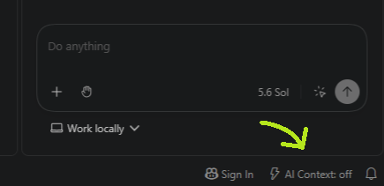

# AI Context Workflow Controller

**Spend fewer tokens on noise. Keep the context that protects your code.**

Token Controller stops AI coding agents from burning through token budgets on repetitive logs, build boilerplate, and noisy terminal output. It manages a lightweight context policy that your IDE agents follow automatically across your projects.

## How it works

* **Smarter Token Usage:** Compresses noisy, repetitive output during routine coding, package installs, and test runs.
* **Guaranteed Fidelity:** Automatically enforces lossless, raw context for first failing errors, stack traces, security audits, and database migrations.
* **One-Click Control:** Switch context modes seamlessly via the terminal (`workflow code`, `workflow debug`) or the VS Code Status Bar dropdown.



*Token Controller acts as the context router and guardrail layer. It defines when to compress and when to preserve raw evidence, helping your connected agents and tools keep sessions focused and cost-effective.*

## Why this matters (even with million-token context windows)

Context windows have reached massive scales, but simply having a larger window does not eliminate the need for optimization. In fact, unmanaged capacity often leads to **"context rot."** As the window fills with raw logs, uncompressed MCP (Model Context Protocol) tool outputs, and irrelevant file contents, the AI's attention dilutes. This causes reasoning drops, latency spikes, and unnecessary inference costs.

While native IDE features and RAG (Retrieval-Augmented Generation) are highly effective at finding static code snippets, they lack awareness of your immediate engineering intent. This controller bridges that gap:

* **Proactive vs. Reactive:** RAG reacts to your prompt. This tool proactively broadcasts the current state of your work to the agent[cite: 12].
* **Risk-Based Fidelity:** An IDE indexer does not inherently know that a database migration requires higher fidelity than a UI component update. When you run critical modes (like `workflow db`), this tool forces the agent to preserve strict, lossless context.
* **Establishing Boundaries:** By injecting the rules directly into a project's `AGENTS.md`, you establish a firm guardrail explicitly telling the agent that correctness always beats token savings[cite: 12].

## Supported environment

> **Currently supported and tested only on WSL 2 with Ubuntu, using VS Code connected to the same WSL distro through the WSL extension.** The current validation environment is Ubuntu 24.04 x86-64 on WSL2 with Bash 5.2 and `jq` 1.8.

Native Windows, WSL 1, macOS, native Linux, Dev Containers, SSH remotes, and GitHub Codespaces have not been verified. They may work, but they are not currently supported by this project.

Environment requirements and assumptions:

* Run the setup and workflow commands in a WSL Bash terminal, not PowerShell or Command Prompt.
* Open the project from that same WSL distro in VS Code. The terminal, extension, controller files, and `~/.config/ai-workflow/active_mode.env` must resolve to the same Linux home directory.
* Each WSL distro has its own Linux home and active-mode file. If you use multiple distros, install and configure the controller separately in each one.
* Keep the controller and projects in the WSL Linux filesystem, such as `~/tools` and `~/projects`. Windows-mounted paths such as `/mnt/c/...` are unverified and may behave differently for permissions, file watching, and shell scripts.
* Keep shell scripts in Linux LF format. Windows CRLF conversion can prevent Bash from reading them correctly.
* Use Bash. The documented alias is added to `~/.bashrc`; zsh, fish, and other shells are not currently documented or tested.
* Install Git and `jq`. Standard Ubuntu tools such as `grep`, `mktemp`, `cp`, `mv`, and `chmod` are also required.
* Keep `~/.config` writable so the active-mode file can be created and updated.
* Optional context tools are not required. Install them only if you intend to use their features.

For the VS Code button, install the extension into the **WSL extension host**, not only into local Windows VS Code. See the [VS Code extension requirements](extensions/vscode/README.md).

## VS Code Extension Installation (WSL & Remote)

If you use VS Code with WSL, installing the extension via the terminal can sometimes fail to register with the Windows UI. The most reliable method is using the VS Code graphical interface:

**SIMPLE METHOD:** Download the 'extensions/vscode/token-controller-ui-x.x.x.vsix' and install it via VS Code UI, OR...

## Clone the repository

1. Clone the repository and navigate into it
2. Build the extension inside your WSL terminal

   ```bash
   cd extensions/vscode
   npx vsce package
   ```
3. Open VS Code (ensure you are connected to your WSL environment).
4. Open the Extensions panel (Ctrl + Shift + X).
5. Click the ... (Views and More Actions) icon at the top right of the Extensions panel.
6. Select Install from VSIX...
7. Navigate to the generated .vsix file and select it.
8. Reload the window (Ctrl + Shift + P -> Developer: Reload Window).

You keep one copy of the controller on your computer. Then, inside each project, you run `workflow init`. That creates or updates the project's local `AGENTS.md`. Your coding agents read that file and check the active workflow mode before they answer or modify files.

The selected policy is saved in:

```text
~/.config/ai-workflow/active_mode.env
```

## The simple flow

```text
One central clone
      │
      ├── workflow init ──────> project/AGENTS.md
      │                          project-local agent rules
      │
      └── workflow <mode> ────> ~/.config/ai-workflow/active_mode.env
                                 current context policy
```

For everyday use, remember only two commands:

```bash
workflow init
workflow code
```

## Quick start and depencies

You need the supported WSL2/Ubuntu environment described above, plus Bash, Git, and `jq`. If Git or `jq` is missing:

```bash
sudo apt install -y jq git
```

### 1. Clone the controller once

Choose one central location and keep the controller there:

```bash
mkdir -p ~/tools
git clone <repository-url> ~/projects/token-controller
```

If you choose a different location, use that path in the alias below.

### 2. Add the `workflow` alias

Run this once:

```bash
echo "alias workflow='source ~/projects/token-controller/scripts/workflow.sh'" >> ~/.bashrc
source ~/.bashrc
```

Check that the alias works:

```bash
workflow status
```

### 3. Initialize each project

Go to a project and run `workflow init`:

```bash
cd ~/projects/my-project
workflow init
```

This changes only the `AGENTS.md` in the current project:

* If `AGENTS.md` is missing, the command creates it from `templates/AGENTS_base.md`.
* If `AGENTS.md` already exists, the command keeps the project's custom instructions and appends the required AI workflow rules.
* If you run `workflow init` again, it does not add duplicate rules.

Commit the generated or updated `AGENTS.md` if you want everyone working on the project to use the same rules.

### 4. Choose a mode before you work

Pick the mode that matches your task:

```bash
workflow architect
workflow code
workflow debug
```

The selected mode applies to the current shell and is also written to `~/.config/ai-workflow/active_mode.env` for agents to read.

See the current mode at any time:

```bash
workflow status
```

## Everyday example

```bash
cd ~/projects/my-project

# Run once for this project.
workflow init

# Understand the structure before making changes.
workflow architect

# Switch when implementation begins.
workflow code

# Use this if a test fails.
workflow debug
```

You can switch modes as often as needed. Running `workflow init` is normally a one-time step per project.

### Step-by-Step Local Cleanup / Uninstall Commands

Bash

```bash
# 1. Remove the active workflow cache directory
rm -rf ~/.config/ai-workflow

# 2. Remove generated global instruction files
rm -f ~/.copilot/instructions/ai-workflow.instructions.md
rm -f ~/.claude/CLAUDE.md

# 3. Clean up the current project's test AGENTS.md (if testing in a dummy folder)
rm -f ./AGENTS.md

# 4.a.  Remove the Shell Alias. Open your ~/.bashrc file in a text editor (or via terminal):
nano ~/.bashrc
# 4.b   Find and delete the following line:
alias workflow='source ~/projects/token-controller/scripts/workflow.sh'
# 4.c.  Save the file and refresh your terminal session:
source ~/.bashrc

# 5. (Optional) Remove installed Python virtual environments if resetting optional tools
rm -rf ~/.venvs/headroom ~/.venvs/memstack
```

#### One-Liner to Launch a Container

Run this from your `token-controller` project root directory:

Bash

```bash
docker run --rm -it -v "$PWD":/workspace -w /workspace ubuntu:24.04 bash
```

## Scenario matrix

Use this table when you are unsure which mode to choose.


| Scenario                           | Command                    | Context behavior                                 | Evidence that must stay complete                            |
| ---------------------------------- | -------------------------- | ------------------------------------------------ | ----------------------------------------------------------- |
| Requirements and scope             | `workflow scope`           | Summarize carefully                              | User intent, constraints, acceptance criteria               |
| Architecture and structure         | `workflow architect`       | Map the codebase, then read selected files fully | Interfaces, module boundaries, design reasoning             |
| Models, schemas, and decisions     | `workflow decisions`       | Preserve contracts and types                     | Schemas, invariants, API contracts                          |
| Normal coding                      | `workflow code`            | Keep target files full; summarize dependencies   | Edited files, nearby tests, compiler errors                 |
| Rapid prototype                    | `workflow rapid-prototype` | Compress successful build noise aggressively     | Backend API errors, migration warnings, raw failure logs    |
| Small snippet review               | `workflow snippet`         | Use little or no compression                     | The complete snippet, method, or file                       |
| Agent-rule work                    | `workflow agent`           | Keep agent instructions stable                   | `AGENTS.md` and dynamic task-state files                    |
| Data analysis                      | `workflow data-analysis`   | Preserve numeric evidence                        | Numbers, units, statistics, plots, data sources             |
| Bug fixing                         | `workflow debug`           | Keep the first failure raw                       | Error, stderr, exit code, stack origin, paths, line numbers |
| Unit and integration tests         | `workflow test`            | Compress passing noise only                      | Failing tests, assertions, stack traces                     |
| Full test suite                    | `workflow test-full`       | Compress successful repetition                   | First failure and final test summary                        |
| Documentation                      | `workflow docs`            | Gather sources efficiently; write normal prose   | Final documentation and factual behavior                    |
| CI/CD                              | `workflow cicd`            | Compress install and fetch boilerplate           | Workflow files, scripts, environment, failing lines         |
| Codebase or pull-request review    | `workflow review`          | Index first, then read important files fully     | Diffs, public interfaces, risk areas                        |
| Security and compliance            | `workflow security`        | Raw or lossless context only                     | CVEs, secrets, auth, crypto, license findings               |
| Large refactor or legacy migration | `workflow migration`       | Use a global map and full active files           | Compatibility rules and changed files                       |
| Database migration                 | `workflow db`              | Raw or lossless context only                     | SQL, constraints, ordering, data-loss warnings              |
| Performance work                   | `workflow perf`            | Preserve measurements exactly                    | Timings, percentiles, memory, sample size, environment      |
| Release preparation                | `workflow release`         | Raw or lossless context only                     | Versions, changelog, artifacts, hashes, signing output      |
| Maximum fidelity                   | `workflow raw`             | Disable compression                              | Everything                                                  |
| Disable optimizers                 | `workflow off`             | Turn optional optimization modes off             | Normal shell output                                         |

Aliases kept for compatibility:

```bash
workflow plan   # same as workflow architect
workflow ci     # same as workflow cicd
```

## Safety rules in plain language

* Correctness is more important than saving tokens.
* `raw`, `security`, `db`, and `release` use raw or lossless context.
* `debug` and `test` keep the first failure, stderr, exit code, paths, and line numbers.
* Target files being edited should be read in full.
* Repetitive successful output is the safest content to compress.
* Optional tools must be detected before an agent relies on them.

## What `workflow init` adds

The reusable template is stored at:

```text
templates/AGENTS_base.md
```

The injected rules tell agents to:

* check `~/.config/ai-workflow/active_mode.env` before working;
* follow the selected risk and fidelity policy;
* preserve failures and high-risk evidence;
* avoid assuming optional tools are installed;
* keep project-specific instructions intact.

Managed markers make the operation repeatable. If an existing managed block is incomplete, or `AGENTS.md` is a symbolic link, `workflow init` stops instead of making a risky change.

## Optional global editor setup

Project-local `AGENTS.md` files are the main distribution method. You can also add the same rule to supported global VS Code and agent settings:

```bash
workflow setup
```

This command is optional. It updates supported Copilot settings and instruction files, and adds rules for detected Gemini Code Assist or Claude Code installations. Existing settings are preserved, and the same rule is not added twice.

The VS Code settings updater expects a strict JSON `settings.json`. It stops without replacing files that contain JSON comments or trailing commas.

## Optional context tools

RTK, Headroom, LeanCTX, MemStack, and Caveman are not required to use this controller. The controller only exports policy variables; compatible tools may choose to act on them.

To inspect what is installed:

```bash
bash ~/tools/token-controller/scripts/check-tools.sh
```

The optional installer installs base prerequisites and then prints tool-specific commands for review:

```bash
bash ~/tools/token-controller/scripts/install-optional-tools.sh
```

If you choose to install the Python tools using those printed commands, their virtual environments are:

* Headroom: `~/.venvs/headroom`
* MemStack: `~/.venvs/memstack`

## What the optional tools do

While not required, installing these tools activates the "Mechanical" compression layer, intercepting noise before the AI agent even has to read it:

* **RTK (Terminal Hook):** Intercepts and physically compresses noisy terminal output (like `npm install` or massive test passing logs) directly in the shell.
* **LeanCTX (MCP Server):** Provides semantic codebase graphing and context-aware file reading, preventing agents from doing massive, token-heavy `cat` dumps of large files.
* **Headroom (MCP/Proxy):** Acts as a local proxy that semantically caches prompt inputs and intelligently trims historical noise before hitting the model API.
* **MemStack:** A local memory layer primarily oriented around Claude Code, allowing agents to preserve long-running task context across sessions.
* **Caveman:** A legacy standalone output-brevity tool (Note: largely frozen as of August 2026, evaluate before installing).

## Controlling Changes (Validation Matrix)

Whenever a new mode is added or a shell policy is changed, it must be documented to prevent regressions. We maintain a ledger in `docs/VALIDATION_MATRIX.md`.

When testing a change, you must record:

1. The target scenario and the active profile.
2. The exact commands executed (e.g., `wx build`).
3. Which optional tools were active versus missing.
4. The estimated raw token size vs. the compressed token size.
5. The pass/fail result indicating if critical evidence (like a stack trace) was safely preserved.

## Useful commands


| Command           | Purpose                                                  |
| ----------------- | -------------------------------------------------------- |
| `workflow init`   | Create or safely extend the current project's`AGENTS.md` |
| `workflow setup`  | Configure optional global editor instructions            |
| `workflow <mode>` | Select a context mode                                    |
| `workflow status` | Show the active mode and policy                          |
| `workflow off`    | Disable optional optimizers                              |
| `workflow help`   | List available commands and modes                        |

## Repository layout

```text
token-controller/
├── README.md
├── config/
│   └── workflow_settings.json
├── docs/
│   └── VALIDATION_MATRIX.md
├── prompts/
│   └── vscode-agent-prompts.md
├── scripts/
│   ├── check-tools.sh
│   ├── install-optional-tools.sh
│   └── workflow.sh
└── templates/
    └── AGENTS_base.md
```

## Development checks

The controller itself needs only Bash and `jq` for its basic checks:

```bash
bash -n scripts/workflow.sh
jq . config/workflow_settings.json >/dev/null
```

Detailed validation results live in `docs/VALIDATION_MATRIX.md`.
