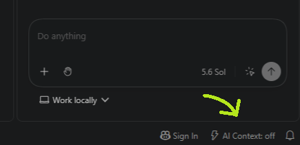

# AI Context Workflow Controller

**Choose how agents should handle context, while keeping high-risk evidence visible.**

Token Controller is a mode switcher for AI context policy. The goal is to orchestrate proven context tools (RTK, LeanCTX, Headroom, Caveman) per work mode. Today it records the selected profile, installs project guidance for compatible agents, and exports policy variables that those tools may act on. It does not yet launch or configure them.

The `wx` wrapper is the safety and measurement layer: it captures raw output, preserves exit codes, and records byte counts for commands run as `wx <command>`. Its only built-in compression collapses consecutive identical stdout lines for successful allowlisted commands. It is a fallback, not the main token-saving mechanism. Token Controller does not enforce agent compliance, measure model tokens, or guarantee token savings.

## How it works

* **Profile control:** `workflow <mode>` exports policy variables and writes them to `~/.config/ai-workflow/active_mode.env`.
* **Project guidance:** `workflow init` creates or extends `AGENTS.md` with instructions for agents to read the active profile and preserve specified evidence.
* **Explicit command capture:** `wx <command>` runs the command directly, always saves raw stdout/stderr, applies only eligible conservative compression, records raw and visible byte counts under `.ai-context/`, prints the raw-log location, and preserves the command's exit code.
* **VS Code control:** The Status Bar dropdown provides another way to select a profile.



The implementation has three distinct layers:

| Layer | Current status |
| --- | --- |
| Policy layer | Stable controller behavior: profiles, environment variables, the active-mode file, and injected agent instructions express the requested context policy. |
| Mechanical layer | The explicit `wx` wrapper captures raw evidence and collapses exact consecutive repetitions only for eligible successful stdout. Failures and protected profiles or commands remain raw. |
| Measured savings layer | Per-run metadata records raw and visible byte counts; the benchmark also captures total emitted bytes including wrapper diagnostics. Fixture validation demonstrates byte reduction, but no tokenizer-backed token-saving result has been established. |

## Why this matters (even with million-token context windows)

Context windows have reached massive scales, but simply having a larger window does not eliminate the need for optimization. In fact, unmanaged capacity often leads to **"context rot."** As the window fills with raw logs, uncompressed MCP (Model Context Protocol) tool outputs, and irrelevant file contents, the AI's attention dilutes. This causes reasoning drops, latency spikes, and unnecessary inference costs.

While native IDE features and RAG (Retrieval-Augmented Generation) are highly effective at finding static code snippets, they lack awareness of your immediate engineering intent. This controller bridges that gap:

* **Proactive vs. Reactive:** RAG reacts to your prompt. This tool publishes the selected work profile through shell variables, an active-mode file, and project instructions that compatible agents can read.
* **Risk-Based Fidelity:** An IDE indexer does not inherently know that a database migration requires higher fidelity than a UI component update. Critical modes such as `workflow db` request strict, lossless handling from the agent and connected tools; the controller does not independently verify that they comply.
* **Establishing Boundaries:** Injecting rules into a project's `AGENTS.md` gives compatible agents an explicit policy that correctness takes priority over token savings. Those instructions are a policy guardrail, not mechanical enforcement.

## Supported environment

> **Currently supported and tested only on WSL 2 with Ubuntu, using VS Code connected to the same WSL distro through the WSL extension.** The current validation environment is Ubuntu 24.04 x86-64 on WSL2 with Bash 5.2 and `jq` 1.8.

Native Windows, WSL 1, macOS, native Linux, Dev Containers, SSH remotes, and GitHub Codespaces have not been verified. They may work, but they are not currently supported by this project.

Environment requirements and assumptions:

* Run the setup and workflow commands in a WSL Bash terminal, not PowerShell or Command Prompt.
* Open the project from that same WSL distro in VS Code. The terminal, extension, controller files, and `~/.config/ai-workflow/active_mode.env` must resolve to the same Linux home directory.
* Each WSL distro has its own Linux home and active-mode file. If you use multiple distros, install and configure the controller separately in each one.
* Keep the controller and projects in the WSL Linux filesystem, such as `~/tools` and `~/projects`. Windows-mounted paths such as `/mnt/c/...` are unverified and may behave differently for permissions, file watching, and shell scripts.
* Keep shell scripts in Linux LF format. Windows CRLF conversion can prevent Bash from reading them correctly.
* Use Bash. The documented alias is added to `~/.bashrc`; zsh, fish, and other shells are not currently documented or tested.
* Install Git and `jq`. Standard Ubuntu tools such as `grep`, `mktemp`, `cp`, `mv`, and `chmod` are also required.
* Keep `~/.config` writable so the active-mode file can be created and updated.
* Optional context tools are not required. Install them only if you intend to use their features.

For the VS Code button, install the extension into the **WSL extension host**, not only into local Windows VS Code. See the [VS Code extension requirements](extensions/vscode/README.md).

## VS Code Extension Installation (WSL & Remote)

If you use VS Code with WSL, installing the extension via the terminal can sometimes fail to register with the Windows UI. The most reliable method is using the VS Code graphical interface:

**SIMPLE METHOD:** Download the 'extensions/vscode/token-controller-ui-x.x.x.vsix' and install it via VS Code UI

**OR**

## Clone the repository

1. Clone the repository and navigate into it
2. Build the extension inside your WSL terminal

   ```bash
   cd extensions/vscode
   npx vsce package
   ```
3. Open VS Code (ensure you are connected to your WSL environment).
4. Open the Extensions panel (Ctrl + Shift + X).
5. Click the ... (Views and More Actions) icon at the top right of the Extensions panel.
6. Select Install from VSIX...
7. Navigate to the generated .vsix file and select it.
8. Reload the window (Ctrl + Shift + P -> Developer: Reload Window).

You keep one copy of the controller on your computer. Then, inside each project, you run `workflow init`. That creates or updates the project's local `AGENTS.md` with instructions telling compatible coding agents to check the active workflow mode before they answer or modify files.

The selected policy is saved in:

```text
~/.config/ai-workflow/active_mode.env
```

## The simple flow

```text
One central clone
      │
      ├── workflow init ──────> project/AGENTS.md
      │                          project-local agent rules
      │
      └── workflow <mode> ────> ~/.config/ai-workflow/active_mode.env
                                 current context policy
```

For everyday use, remember only two commands:

```bash
workflow init
workflow code
```

## Quick start and dependencies

You need the supported WSL2/Ubuntu environment described above, plus Bash, Git, and `jq`. If Git or `jq` is missing:

```bash
sudo apt install -y jq git
```

### 1. Clone the controller once

Choose one central location and keep the controller there:

```bash
mkdir -p ~/projects
git clone <repository-url> ~/projects/token-controller
```

If you choose a different location, use that path in the alias below.

### 2. Add the `workflow` alias

Run this once:

```bash
echo "alias workflow='source ~/projects/token-controller/scripts/workflow.sh'" >> ~/.bashrc
source ~/.bashrc
```

Check that the alias works:

```bash
workflow status
```

### 3. Initialize each project

Go to a project and run `workflow init`:

```bash
cd ~/projects/my-project
workflow init
```

Within the current project, this changes only `AGENTS.md`; the controller also ensures that its user-level configuration directory exists.

* If `AGENTS.md` is missing, the command creates it from `templates/AGENTS_base.md`.
* If `AGENTS.md` already exists, the command keeps the project's custom instructions and appends the required AI workflow rules.
* If you run `workflow init` again, it does not add duplicate rules.

Commit the generated or updated `AGENTS.md` if you want everyone working on the project to use the same rules.

### 4. Choose a mode before you work

Pick the mode that matches your task:

```bash
workflow architect
workflow code
workflow debug
```

The selected mode applies to the current shell and is also written to `~/.config/ai-workflow/active_mode.env` for agents to read.

Because the alias sources `workflow.sh`, it also makes the `wx` function available in that shell. Commands are mechanically captured and measured only when they are invoked through `wx`:

```bash
workflow code
wx npm test
workflow report
```

Direct `npm test` output is not captured or compressed by Token Controller unless an optional integration blocks the direct command and requires a retry through `wx`.

See the current mode at any time:

```bash
workflow status
```

## Everyday example

```bash
cd ~/projects/my-project

# Run once for this project.
workflow init

# Understand the structure before making changes.
workflow architect

# Switch when implementation begins.
workflow code

# Use this if a test fails.
workflow debug
```

You can switch modes as often as needed. Running `workflow init` is normally a one-time step per project.

### Step-by-Step Local Cleanup / Uninstall Commands

Bash

```bash
# 1. Remove the active workflow cache directory
rm -rf ~/.config/ai-workflow

# 2. Remove generated global instruction files
rm -f ~/.copilot/instructions/ai-workflow.instructions.md
rm -f ~/.claude/CLAUDE.md

# 3. Clean up the current project's test AGENTS.md (if testing in a dummy folder)
rm -f ./AGENTS.md

# 4.a.  Remove the Shell Alias. Open your ~/.bashrc file in a text editor (or via terminal):
nano ~/.bashrc
# 4.b   Find and delete the following line:
alias workflow='source ~/projects/token-controller/scripts/workflow.sh'
# 4.c.  Save the file and refresh your terminal session:
source ~/.bashrc

# 5. (Optional) Remove installed Python virtual environments if resetting optional tools
rm -rf ~/.venvs/headroom ~/.venvs/memstack
```

#### One-Liner to Launch a Container

Run this from your `token-controller` project root directory:

Bash

```bash
docker run --rm -it -v "$PWD":/workspace -w /workspace ubuntu:24.04 bash
```

## Scenario matrix

Use this table when you are unsure which mode to choose. It describes the policy requested from an agent or connected tool, not behavior the controller independently enforces.


| Scenario                           | Command                    | Requested policy                                 | Evidence requested complete                                 |
| ---------------------------------- | -------------------------- | ------------------------------------------------ | ----------------------------------------------------------- |
| Requirements and scope             | `workflow scope`           | Summarize carefully                              | User intent, constraints, acceptance criteria               |
| Architecture and structure         | `workflow architect`       | Map the codebase, then read selected files fully | Interfaces, module boundaries, design reasoning             |
| Models, schemas, and decisions     | `workflow decisions`       | Preserve contracts and types                     | Schemas, invariants, API contracts                          |
| Normal coding                      | `workflow code`            | Keep target files full; summarize dependencies   | Edited files, nearby tests, compiler errors                 |
| Rapid prototype                    | `workflow rapid-prototype` | Compress successful build noise aggressively     | Backend API errors, migration warnings, raw failure logs    |
| Small snippet review               | `workflow snippet`         | Use little or no compression                     | The complete snippet, method, or file                       |
| Agent-rule work                    | `workflow agent`           | Keep agent instructions stable                   | `AGENTS.md` and dynamic task-state files                    |
| Data analysis                      | `workflow data-analysis`   | Preserve numeric evidence                        | Numbers, units, statistics, plots, data sources             |
| Bug fixing                         | `workflow debug`           | Keep the first failure raw                       | Error, stderr, exit code, stack origin, paths, line numbers |
| Unit and integration tests         | `workflow test`            | Compress passing noise only                      | Failing tests, assertions, stack traces                     |
| Full test suite                    | `workflow test-full`       | Compress successful repetition                   | First failure and final test summary                        |
| Documentation                      | `workflow docs`            | Gather sources efficiently; write normal prose   | Final documentation and factual behavior                    |
| CI/CD                              | `workflow cicd`            | Compress install and fetch boilerplate           | Workflow files, scripts, environment, failing lines         |
| Codebase or pull-request review    | `workflow review`          | Index first, then read important files fully     | Diffs, public interfaces, risk areas                        |
| Security and compliance            | `workflow security`        | Raw or lossless context only                     | CVEs, secrets, auth, crypto, license findings               |
| Large refactor or legacy migration | `workflow migration`       | Use a global map and full active files           | Compatibility rules and changed files                       |
| Database migration                 | `workflow db`              | Raw or lossless context only                     | SQL, constraints, ordering, data-loss warnings              |
| Performance work                   | `workflow perf`            | Preserve measurements exactly                    | Timings, percentiles, memory, sample size, environment      |
| Release preparation                | `workflow release`         | Raw or lossless context only                     | Versions, changelog, artifacts, hashes, signing output      |
| Maximum fidelity                   | `workflow raw`             | Disable compression                              | Everything                                                  |
| Disable optimizers                 | `workflow off`             | Turn optional optimization modes off             | Normal shell output                                         |

Aliases kept for compatibility:

```bash
workflow plan   # same as workflow architect
workflow ci     # same as workflow cicd
```

## Policy rules in plain language

These rules are written into the active profile and agent instructions. Their execution depends on the agent and any connected context tool; the `wx` wrapper does not inspect output to verify them.

* Correctness is more important than saving tokens.
* `raw`, `security`, `db`, and `release` use raw or lossless context.
* `debug` and `test` keep the first failure, stderr, exit code, paths, and line numbers.
* Target files being edited should be read in full.
* Repetitive successful output is the safest content to compress.
* Optional tools must be detected before an agent relies on them.

## What `workflow init` adds

The reusable template is stored at:

```text
templates/AGENTS_base.md
```

The injected rules tell agents to:

* check `~/.config/ai-workflow/active_mode.env` before working;
* follow the selected risk and fidelity policy;
* preserve failures and high-risk evidence;
* avoid assuming optional tools are installed;
* keep project-specific instructions intact.

Managed markers make the operation repeatable. If an existing managed block is incomplete, or `AGENTS.md` is a symbolic link, `workflow init` stops instead of making a risky change.

## Optional global editor setup

Project-local `AGENTS.md` files are the main distribution method. You can also add the same rule to supported global VS Code and agent settings:

```bash
workflow setup
```

This command is optional. It updates supported Copilot settings and instruction files, and adds rules for detected Gemini Code Assist or Claude Code installations. Existing settings are preserved, and the same rule is not added twice.

The VS Code settings updater expects a strict JSON `settings.json`. It stops without replacing files that contain JSON comments or trailing commas.

## Optional context tools

RTK, Headroom, LeanCTX, MemStack, and Caveman are not required to use this controller. The `wx` capture layer does not invoke them; outside that layer, the controller only exports policy variables that compatible tools may choose to act on.

To inspect what is installed:

```bash
bash ~/tools/token-controller/scripts/check-tools.sh
```

The optional installer installs base prerequisites and then prints tool-specific commands for review:

```bash
bash ~/tools/token-controller/scripts/install-optional-tools.sh
```

If you choose to install the Python tools using those printed commands, their virtual environments are:

* Headroom: `~/.venvs/headroom`
* MemStack: `~/.venvs/memstack`

## Mechanical `wx` layer and optional integrations

The built-in mechanical boundary is explicit: `wx <command>` runs the command, captures raw stdout and stderr under `.ai-context/raw/`, preserves the exit code, emits either lossless or deterministic exact-repeat output, prints a raw-log pointer, and appends byte measurements to `.ai-context/session.jsonl`.

Compression is conservative. A successful command is compressed only when it matches `noisy_success_can_compress` in `config/workflow_settings.json`. Nonzero exits and profiles or commands classified as security, database, release, migration, or `preserve_raw_or_lossless` remain lossless.

Optional integrations may increase `wx` coverage, but are not installed automatically:

* **Claude Code hook example:** [`integrations/claude-code/README.md`](integrations/claude-code/README.md) documents an opt-in `PreToolUse` hook. It blocks selected direct test, build, install, and Docker commands and tells the agent to retry as `wx <command>`; it does not silently mutate commands.
* **RTK:** `wx` no longer delegates command execution to RTK. Any future RTK integration must occur after the wrapper has captured authoritative raw output.
* **LeanCTX, Headroom, and MemStack:** The controller exports mode variables for possible integrations, but it does not launch, configure, or verify these tools. MemStack support is legacy and under review.
* **Caveman:** The controller exports a compatibility variable, disabled by the current profiles; no automatic invocation is implemented.

There is no universal interception layer. Commands run directly remain outside `wx` unless a separately configured hook or host integration enforces wrapper usage. The included Claude Code hook is an example for that host only, not proof that other agents, IDEs, terminals, or MCP clients will route commands through `wx`.

## Controlling Changes (Validation Matrix)

`docs/VALIDATION_MATRIX.md` records validation evidence for `wx` behavior. It becomes the required record for every mode or policy change once external tools are integrated and measurable.

The ledger includes paired raw/visible/emitted byte measurements for deterministic fixtures. These measurements validate the wrapper behavior but do not prove tokenizer-measured or universal savings for the controller as a whole.

Run the WSL2/Ubuntu benchmark from the repository root:

```bash
bash benchmarks/run-benchmark.sh
```

To retain its copy-ready Markdown summary:

```bash
bash benchmarks/run-benchmark.sh > /tmp/token-controller-benchmark.md
```

The benchmark compares each fixture through a normal shell and through `wx`, includes the raw-log pointer in emitted-byte totals, and verifies that failure, security, and database evidence stays lossless. See [`benchmarks/README.md`](benchmarks/README.md) for metric definitions.

When testing a change, you must record:

1. The target scenario and the active profile.
2. The exact commands executed (e.g., `wx build`).
3. Which optional tools were active versus missing.
4. The measured raw, visible-command, and total emitted byte counts.
5. Any separately measured tokenizer counts, including the tokenizer and version; byte reduction alone is not token reduction.
6. The pass/fail result indicating whether critical evidence, such as a stack trace, was preserved.

## Session reporting and reset

Summarize the current project's `.ai-context/session.jsonl` measurements:

```bash
workflow report
```

Archive the current JSONL session and start a new empty session:

```bash
workflow reset-session
```

Resetting a session does not delete `.ai-context/raw/`. The archived JSONL is stored under `.ai-context/archive/`.

## Limitations

* Savings depend on command coverage. Token Controller measures only commands run through `wx`; direct commands are unchanged unless an opt-in hook forces a retry through `wx`.
* Compression is deterministic exact-repeat collapsing, not semantic or AI-generated summarization. Non-repetitive successful output may not become smaller.
* The mandatory raw-log pointer adds visible bytes. Short or protected commands can therefore emit more bytes than the original command.
* Reported percentages are byte reductions derived from `.ai-context/session.jsonl`, not universal model-token, latency, quality, or cost guarantees.
* Raw logs are retained intentionally and may contain sensitive command output. Protect `.ai-context/` appropriately and remove logs only through an explicit user-controlled process.
* The Claude Code hook is an optional example. It recognizes a conservative command set, does not parse every nested shell form, and does not cover other hosts automatically.

## Useful commands


| Command           | Purpose                                                  |
| ----------------- | -------------------------------------------------------- |
| `workflow init`   | Create or safely extend the current project's`AGENTS.md` |
| `workflow setup`  | Configure optional global editor instructions            |
| `workflow <mode>` | Select a context mode                                    |
| `workflow status` | Show the active mode and policy                          |
| `wx <command>`    | Capture, preserve, optionally compress, and measure output |
| `workflow report` | Summarize command, byte, reduction, and failure counts   |
| `workflow reset-session` | Archive session metadata without deleting raw logs |
| `workflow off`    | Select the off policy                                      |
| `workflow help`   | List available commands and modes                        |

## Repository layout

```text
token-controller/
├── README.md
├── benchmarks/
│   ├── README.md
│   ├── run-benchmark.sh
│   └── fixtures/
├── config/
│   └── workflow_settings.json
├── docs/
│   └── VALIDATION_MATRIX.md
├── integrations/
│   └── claude-code/
├── prompts/
│   └── vscode-agent-prompts.md
├── scripts/
│   ├── check-tools.sh
│   ├── install-optional-tools.sh
│   ├── workflow.sh
│   └── lib/
│       ├── wx.sh
│       ├── wx-compress.sh
│       └── wx-session.sh
└── templates/
    └── AGENTS_base.md
```

## Development checks

The controller itself needs only Bash and `jq` for its basic checks:

```bash
bash -n scripts/workflow.sh
find scripts -name "*.sh" -print0 | xargs -0 -n1 bash -n
jq . config/workflow_settings.json >/dev/null
bash tests/wx-wrapper.test.sh
bash tests/workflow-session.test.sh
bash benchmarks/run-benchmark.sh
```

Validate the optional Claude Code example separately:

```bash
bash -n integrations/claude-code/hooks/pretooluse-bash-policy.sh
jq . integrations/claude-code/settings.example.json >/dev/null
```

Build and package the VS Code extension:

```bash
cd extensions/vscode
npm run compile
npx vsce package
```

Detailed validation results live in `docs/VALIDATION_MATRIX.md`.
